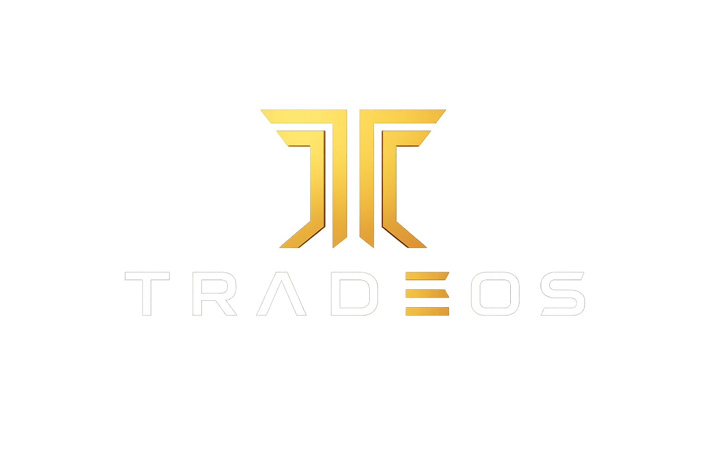
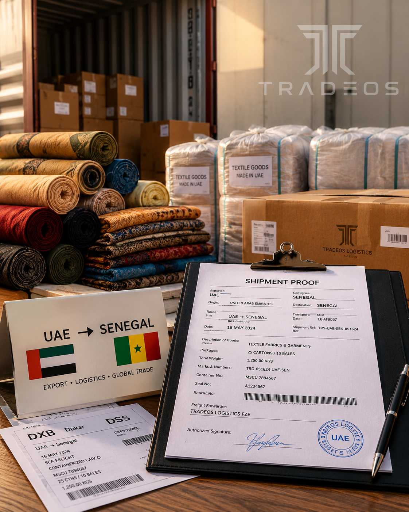
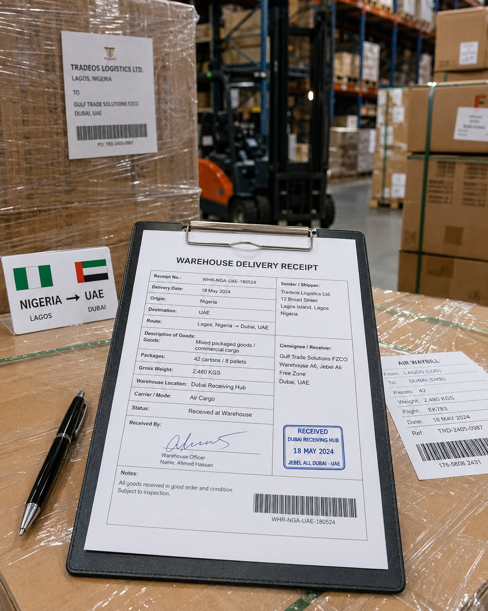

# Tradeos



**Programmable trust infrastructure for real-world corridor trade.**

Tradeos gives buyers and suppliers a structured way to trade across borders using milestone escrow, USDC settlement, proof-of-work releases, document intelligence, reputation signals, and transparent arbitration.

It is built for merchants moving goods through corridors where payment trust, customs pressure, informal charges, FX volatility, delayed settlement, and weak documentation can turn profitable trade into a risky gamble.


## At A Glance

| Layer | What Tradeos Provides |
| --- | --- |
| Settlement | USDC milestone escrow on Solana |
| Workflow | Trade creation, funding, proof upload, release, rejection, dispute |
| Proof | Multi-file proof packs with hashes, timestamps, and optional anchors |
| Intelligence | Corridor document guidance and Tradeos Agent image checks |
| Risk | Counterparty reputation, route signals, dispute incidence, release timing |
| Arbitration | Arbiter panels, vote reasons, admin review, fee allocation |
| Notifications | Optional Telegram trade updates |

## Contents

- [The Problem](#the-problem)
- [What Tradeos Changes](#what-tradeos-changes)
- [Core Corridors](#core-corridors)
- [Corridor-Specific Problems And Tradeos Solutions](#corridor-specific-problems-and-tradeos-solutions)
- [Product System](#product-system)
- [How A Trade Works](#how-a-trade-works)
- [Architecture](#architecture)
- [Repository Structure](#repository-structure)
- [Core Data Model](#core-data-model)
- [Production Setup](#production-setup)
- [License](#license)
- [The Tradeos Thesis](#the-tradeos-thesis)

## The Problem

Cross-border trade is still too dependent on personal trust, bank friction, informal brokers, currency exposure, and scattered evidence. A buyer can pay and still receive poor proof. A supplier can ship and still wait days or weeks for release. A dispute can become a WhatsApp argument with no durable audit trail. A customs or logistics process can introduce charges that are difficult to verify. A currency swing can erase the margin before goods arrive.

Tradeos is built around a simple thesis: trade trust should become infrastructure.

Instead of asking traders to rely on verbal promises, Tradeos lets both parties agree to a programmable trade path:

- Define goods, route, amount, contacts, and milestones.
- Fund escrow in USDC.
- Submit proof for each milestone.
- Release, reject, or dispute based on evidence.
- Use Tradeos Agent to check image proofs against the milestone stage.
- Auto-escalate stale proof submissions after a 120-168 hour response window.
- Resolve disputes through transparent arbitration.
- Preserve receipts, ledger entries, proof hashes, reasons, votes, and reputation events.

Tradeos does not replace lawful taxes, customs rules, licensed financial providers, or required compliance. It reduces avoidable friction: arbitrary extortion, unverifiable promises, hidden FX losses, poor proof standards, and settlement delays.

## What Tradeos Changes

### Autonomous Trust

Trust is converted into executable workflow. A counterparty does not need to be personally familiar to be commercially legible. Their trade history, proof behavior, dispute history, and response time can become measurable.

### Anonymous Or Pseudonymous Trade

Tradeos is wallet-first. Traders can transact with wallet identity and business profile without exposing unnecessary banking details to every counterparty. This is pseudonymous commerce with auditability, not a tool for avoiding lawful obligations.

### Decentralized Settlement

Escrow logic is anchored on Solana. The app coordinates trade workflow, documents, messages, risk, and arbitration, while the settlement layer gives the payment flow stronger guarantees than informal promises.

### No Direct Bank Contact Between Counterparties

Buyer and supplier do not need to exchange bank details for every milestone. Settlement occurs in USDC, and production on-ramp/off-ramp providers can handle fiat entry and exit around the Tradeos wallet.

### Reduced FX Exposure

Corridor traders often lose money between invoice, shipping, customs, delivery, and final settlement. USDC-based milestones reduce the need to renegotiate around volatile local exchange rates.

### Pay For Proof Of Work

Tradeos makes settlement evidence-driven. The supplier gets paid when milestone proof is uploaded and accepted. The buyer gets a structured way to reject weak proof or dispute contested work.

### Ease Of Access For Non-Crypto Traders

Tradeos is designed for real traders first, not blockchain experts. A trader should not need to understand seed phrases, RPCs, token accounts, Solana programs, or wallet extensions before they can create an escrow trade.

Users can create an account with an email address and receive an embedded Solana wallet through the app. This makes Tradeos usable for crypto-last traders, first-time stablecoin users, and merchants who care about getting paid safely more than they care about blockchain mechanics.

The product goal is simple: a trader should be able to create a trade, fund escrow, upload proof, release payment, or open a dispute through familiar business actions. The blockchain runs underneath the workflow instead of becoming the workflow.

### Dispute Memory

Tradeos turns disputes into structured records. Each dispute can preserve the milestone, raised party, reason, arbiter panel, votes, vote reasons, deadlines, fees, outcome, and chain reference when available.

## Core Corridors

Tradeos currently models West Africa and UAE trade in both directions.

| Corridor | Direction |
| --- | --- |
| `NG-UAE` | Nigeria to UAE |
| `UAE-NG` | UAE to Nigeria |
| `GH-UAE` | Ghana to UAE |
| `UAE-GH` | UAE to Ghana |
| `SN-UAE` | Senegal to UAE |
| `UAE-SN` | UAE to Senegal |
| `CI-UAE` | Cote d'Ivoire to UAE |
| `UAE-CI` | UAE to Cote d'Ivoire |

Reverse routes can reuse intelligence from the matching forward corridor while preserving the actual trade direction in the record.


## Corridor-Specific Problems And Tradeos Solutions

### Nigeria: `NG-UAE`, `UAE-NG`

Problems:

- FX volatility between naira, dollar pricing, supplier settlement, and buyer accounting.
- Informal charges around clearing, forwarding, storage, and final delivery.
- Proof standards vary widely across agents, suppliers, and logistics handlers.
- Buyers and suppliers often operate across distance, time zones, and weak legal recourse.

Tradeos solution:

- USDC milestone settlement to reduce currency rate anxiety.
- Proof packs for shipment, customs, delivery, and acceptance stages.
- Tradeos Agent checks for image evidence.
- Buyer response deadlines and auto-escalation when proof is ignored.
- Reputation and dispute history for future counterparty screening.

### Ghana: `GH-UAE`, `UAE-GH`

Problems:

- Settlement can lag behind dispatch or delivery.
- Trade evidence often lives in chat screenshots, informal notes, and scattered documents.
- Buyer and supplier may disagree on whether a milestone was truly completed.

Tradeos solution:

- Structured escrow before shipment.
- Milestone proof tied to specific release percentages.
- Private trade chat plus durable ledger events.
- Arbitration when evidence is contested.

### Senegal: `SN-UAE`, `UAE-SN`

Problems:

- Cross-language documentation mismatch can slow review.
- Shipping, customs, and delivery evidence is not always standardized.
- Local intermediaries can create opacity around responsibility and proof.

Tradeos solution:

- Corridor document guidance by milestone stage.
- Clear payment milestones connected to logistical progress.
- Transparent dispute reasons visible to both parties.
- USDC settlement to reduce currency conversion friction.

### Cote d'Ivoire: `CI-UAE`, `UAE-CI`

Problems:

- FX spread can damage margins.
- Import and export evidence may be incomplete or inconsistent.
- Suppliers are exposed when buyers delay release after proof upload.

Tradeos solution:

- Escrow funded before milestone execution.
- Multi-proof uploads with file hashes and timestamps.
- 120-168 hour buyer response window before auto-escalation.
- On-chain or off-chain dispute logs depending on escrow state.

## Product System


### Milestone Escrow

Each trade is divided into milestones that sum to 100%. A buyer funds escrow, and each milestone can be released independently after proof is accepted.

### Multi-Proof Submission

A supplier can upload multiple proofs for one milestone. Each proof stores file URL, MIME type, SHA-256 hash, optional anchor transaction, uploader, and timestamp.

### Tradeos Agent Check

Tradeos Agent reviews image proofs for document relevance and milestone fit. It can identify likely document type, detect non-document uploads such as logos, flag missing documents, and return a verdict, confidence score, summary, risk flags, and recommended next actions.

Examples:

- A logo uploaded as shipping proof should fail with near-zero confidence.
- A customs clearance document uploaded for "buyer confirms receipt" should be marked as a stage mismatch.
- A delivery receipt with missing consignee, date, or quantity should return caution.



### Corridor Intelligence

Tradeos provides guidance-only document packs for each trade stage. The system recommends documents like commercial invoice, packing list, bill of lading, airway bill, customs declaration, duty receipt, proof of delivery, warehouse receipt, and buyer acceptance confirmation.

These rules are intentionally not strict. Real trade has edge cases, and arbitration should be able to evaluate context.

### Counterparty Risk Scoring

Before funding, traders can view reliability and route risk signals:

- Counterparty reliability score.
- Dispute incidence.
- Completion history.
- Median proof-to-release time.
- Route-level dispute incidence.
- Route-level median proof-to-release time.

### Arbitration Market

Tradeos uses a DAO-like arbitration design:

- Eligible users can become active arbiters.
- Buyers and suppliers cannot arbitrate their own trade.
- A panel of arbiters claims each dispute.
- Arbiters vote for buyer, supplier, or split outcome.
- Every vote requires a reason.
- Admin review can accept, reject, or override during the review window.
- If admin review expires, the panel decision can be enforced.
- Arbiter fees are allocated after resolution.

### Proof Timeout Auto-Escalation

If a supplier uploads proof and the buyer does not release, reject, or dispute, Tradeos can auto-open a dispute after a configurable response window.

Production range:

- Minimum: 120 hours
- Maximum: 168 hours
- Default: 144 hours

This protects suppliers from indefinite buyer silence without forcing automatic release.

### Treasury Wallet

The wallet page shows USDC balance, wallet identity, settlement history, and transaction links. Ramps are represented as production-ready UI but disabled on devnet/testnet.

### On-Ramp And Off-Ramp

Production Tradeos is designed to support fiat-to-USDC and USDC-to-fiat providers. In testnet/devnet, ramps are shown as unavailable because real fiat rails require production providers, compliance checks, and regional rollout.



## How A Trade Works

1. Buyer creates a trade with route, goods, category, amount, logistics details, and milestones.
2. Supplier accepts the invite.
3. Buyer funds escrow in USDC.
4. Supplier uploads milestone proof.
5. Buyer approves and releases, rejects with reason, or disputes.
6. Tradeos Agent can check image proof before buyer action.
7. If buyer stays silent beyond SLA, the milestone auto-escalates.
8. Arbiters review evidence and vote with reasons.
9. Final resolution updates milestone state, trade state, reputation, ledger, receipts, and fee allocation.

## Architecture

Tradeos combines:

- **Next.js** for app pages, dashboard, trades, wallet, ramps, admin, chat, and API routes.
- **PostgreSQL + Prisma** for trades, milestones, proofs, disputes, arbiters, ledger entries, receipts, messages, and reputation.
- **Solana + Anchor** for escrow initialization, funding, milestone release, dispute state, resolution, and refunds.
- **Privy** for wallet-first authentication and embedded Solana wallets.
- **Groq-powered Tradeos Agent** for image proof checks.
- **Telegram bot** for optional trade notifications.
- **Cloud proof upload flow** for document and image evidence.

## Repository Structure

```text
.
|-- app/                       # Next.js application
|   |-- src/app                # App Router pages and API routes
|   |-- src/hooks              # Client workflow hooks
|   |-- src/lib                # Auth, ledger, risk, Solana, arbitration, trade logic
|   |-- src/prisma             # Prisma schema copy used by app tooling
|   `-- public                 # Brand and corridor assets
|-- programs/tradeos           # Solana Anchor program
|-- migrations                 # Database migration history
|-- Anchor.toml                # Anchor workspace config
`-- Cargo.toml                 # Rust workspace config
```

## Core Data Model

Tradeos stores:

- `User`
- `Trade`
- `Milestone`
- `MilestoneProof`
- `MilestoneAiCheck`
- `Dispute`
- `ArbiterProfile`
- `DisputeArbiterAssignment`
- `LedgerEntry`
- `TradeReceipt`
- `TradeMessage`
- `ReputationEvent`

## On-Chain And Off-Chain Dispute Records

When escrow exists on-chain, dispute raising should produce a verified Solana transaction. Tradeos stores the dispute mode in:

- `disputes.arbiter_notes`
- `ledger_entries.metadata.dispute_raise_mode`

Modes:

- `onchain_verified`: dispute has a verified chain transaction.
- `offchain_fallback`: backend dispute exists because the escrow account was not found on-chain.

Production policy should require on-chain dispute state whenever escrow is funded on-chain. Off-chain fallback is useful for recovery, testing, and incomplete escrow states.

## Open-Source And Integration Vision

Tradeos is designed to be integratable.

Marketplaces, logistics operators, merchant communities, and regional trade platforms should be able to plug into Tradeos as a trust, escrow, proof, and arbitration layer.

Future integration surface:

- Public API for trade creation, proof submission, dispute creation, and receipts.
- Webhooks for funding, proof upload, release, dispute open, arbiter vote, and resolution.
- TypeScript SDK.
- Versioned API routes.
- Partner-specific corridor templates.
- Hosted escrow checkout.
- Embedded proof and dispute widgets.

## Production Setup

### Requirements

- Node.js compatible with Next.js 16
- `pnpm`
- PostgreSQL database
- Solana wallet and RPC provider
- Anchor toolchain
- Privy credentials
- USDC mint configuration
- Groq API key for Tradeos Agent
- Production file upload provider
- Optional Telegram bot credentials
- On-ramp/off-ramp provider credentials when fiat rails go live

### Install

```bash
pnpm install
pnpm -C app install
```

### Environment

Create root `.env` and `app/.env.local` values for app, database, Solana, auth, agent, and notification services.

Important variables:

```bash
DATABASE_URL=
NEXT_PUBLIC_APP_URL=
NEXT_PUBLIC_PRIVY_APP_ID=
PRIVY_APP_SECRET=
NEXT_PUBLIC_PROGRAM_ID=
NEXT_PUBLIC_SOLANA_NETWORK=
NEXT_PUBLIC_SOLANA_RPC_URL=
NEXT_PUBLIC_SOLANA_RPC_WS_URL=
NEXT_PUBLIC_USDC_MINT=
NEXT_PUBLIC_ARBITER_WALLET=
NEXT_PUBLIC_ADMIN_WALLETS=
AGENT_API_KEY=
AGENT_MODEL=meta-llama/llama-4-scout-17b-16e-instruct
CRON_SECRET=
PROOF_RESPONSE_SLA_HOURS=144
PROOF_TIMEOUT_CRON_LIMIT=50
ARBITRATION_FEE_BPS=100
ARBITRATION_PANEL_SIGNUP_HOURS=24
ARBITRATION_EVIDENCE_HOURS=24
ARBITRATION_DECISION_HOURS=48
ARBITRATION_ADMIN_OVERRIDE_DAYS=5
TELEGRAM_BOT_TOKEN=
TELEGRAM_WEBHOOK_URL=
TELEGRAM_WEBHOOK_SECRET=
```

### Scheduled Jobs

Tradeos uses Vercel Cron to check proof-response timeouts and open disputes when a buyer does not release, reject, or dispute a submitted proof within the configured SLA.

- Cron route: `/api/internal/proof-timeouts`
- Schedule: daily at `06:00 UTC`
- Auth: Vercel sends `Authorization: Bearer $CRON_SECRET`
- SLA: `PROOF_RESPONSE_SLA_HOURS`, clamped to `120-168` hours
- Batch size: `PROOF_TIMEOUT_CRON_LIMIT`, default `50`

The cron route is intentionally not public. Set `CRON_SECRET` in Vercel before deploying.

### Prisma

```bash
pnpm -C app exec prisma generate
pnpm -C app exec prisma validate
pnpm -C app exec prisma db push
```

### Run App

```bash
pnpm -C app dev
```

### Production Build

```bash
pnpm -C app build
pnpm -C app start
```

### Solana Program

```bash
anchor build
anchor deploy
```

Configured devnet program in `Anchor.toml`:

```text
AJxre8cru2aZNHynSBtFSUSfioCVFHHNiSoPedq8nYP9
```

## License

Tradeos is licensed under the **GNU Affero General Public License v3.0 only** (`AGPL-3.0-only`).

This keeps the project open source while preserving strong copyleft control: if someone modifies Tradeos and runs it for users over a network, they must make the corresponding source code for that modified version available under the same license.

See [LICENSE](LICENSE) for details.

## The Tradeos Thesis

Tradeos wins if corridor traders stop treating trust as a personal risk and start treating it as infrastructure.

The opportunity is larger than escrow. Tradeos can become a trade memory layer:

- who shipped,
- who paid,
- who delayed,
- who disputed,
- what proof was accepted,
- what routes are risky,
- which arbiters are reliable,
- and which counterparties are worth trusting again.

That is how Tradeos can become the trust record for real-world corridor commerce.
